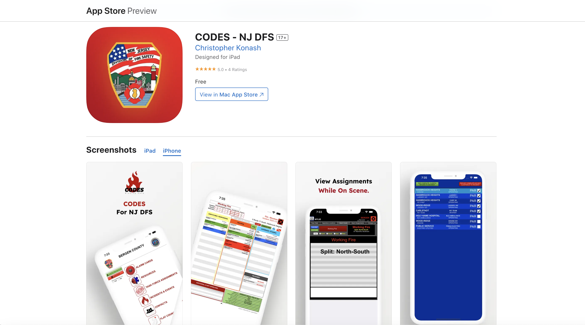
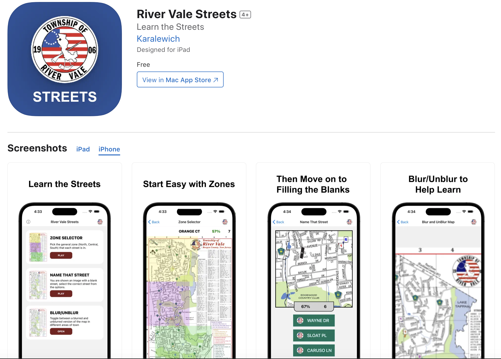
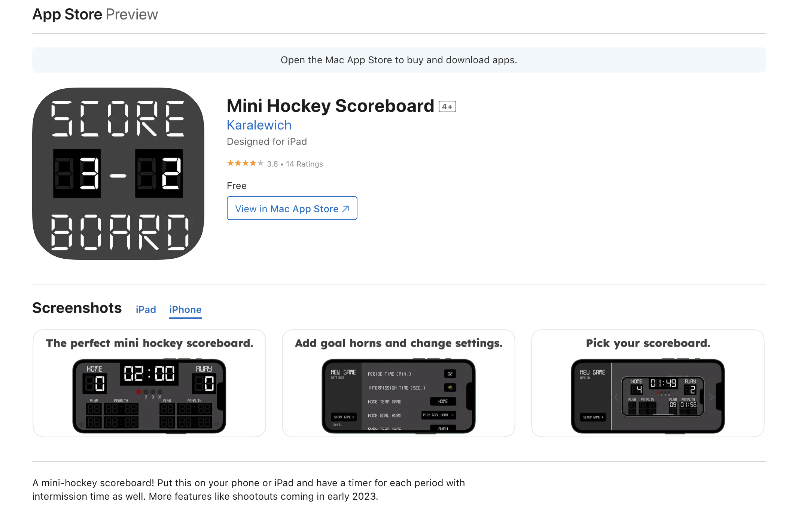
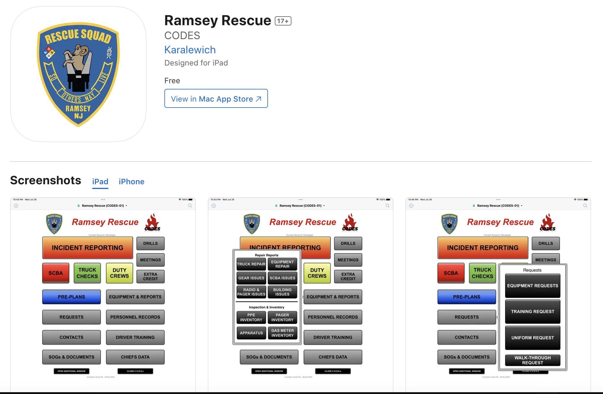

EE322 Labs(https://github.com/vkaralewich/ee322)

# Apps by Karalewich

## App 1: FitCheck

### Download
[App Store Link](https://apps.apple.com/us/app/fitcheck-outfit-of-the-day/id1616665542)

### Description
At FitCheck, our mission is to revolutionize the way you interact with fashion by providing a seamless platform to share and inspire outfit ideas among friends. With our innovative outfit logger app, you can effortlessly curate your digital closet, creating a visual archive of your favorite clothes and accessories. By incorporating tags for clothes and the FitCalendar, we empower you to effortlessly plan and track your stylish journeys, fostering creativity, organization, and a sense of community in the world of fashion.

- FitCalendar: ​​​​Tag It's like a separate camera roll for your outfits! Look back on everything you've worn, weekly and monthly!
- Outfit Sharing: ​Know what your friends are wearing! Get a notification when they post their fits every day, and share yours too!
- Digital Closet: ​Tag clothes from your closet in your outfits, and organize them by groups. Goodbye to your messy closet!
- View Layouts: ​Customization is important to us, which is why we give you three completely different views you can use the app with.

 

## App 2: CODES - NJ DFS

### Download
[App Store Link](https://apps.apple.com/us/app/codes-nj-dfs/id6457414055)

### Description
Improve firefighting capabilities with the NJ DFS CODES App, a collaborative effort that transforms New Jersey Fire Departments. Experience streamlined operations as Mutual Aid Coordinators harness its power to seamlessly manage resources and responses. This app empowers coordinators to swiftly assess needs, allocate resources, and optimize firefighting efforts, ensuring a synchronized and efficient response network.

Gain a comprehensive advantage by accessing county resources and department alarm assignments at your fingertips. The app's intuitive interface allows you to navigate through critical information effortlessly, enhancing situational awareness during emergencies. Stay informed and make informed decisions using real-time data, maximizing the effectiveness of your firefighting strategies. Join the league of proactive fire departments across New Jersey, embracing the future of firefighting coordination with the NJ DFS CODES App. Exclusively for use by NJ DFS.

 

## App 3: River Vale Streets

### Download
[App Store Link](https://apps.apple.com/us/app/river-vale-streets/id6462086759)

[Google Play Store Link](https://play.google.com/store/apps/details?id=com.vkaralewich.RiverValeStreets&pcampaignid=web_share)

### Description
The River Vale Streets App was created to help first responders get to know their streets in town. This app has three ways to help you learn, the first is with Zones. This is the easiest mode as it lets you pick the general area of the streets in town. The hardest feature is Name the Street, which requires you to know exactly where the street is in town. The Blur tool is also a great feature that helps you learn the map on your own pace. Check out the app and make sure to submit feedback!

 

## App 4: Mini Hockey Scoreboard

### Download
[App Store Link](https://apps.apple.com/us/app/mini-hockey-scoreboard/id1626358252)

### Description
A mini-hockey scoreboard! Put this on your phone or iPad and have a timer for each period with intermission time as well. The scoreboard has custom time, goal horns, and team names. Use this when you are playing mini hockey with your friends!

 

## App 5: Ramsey Rescue

### Download
[App Store Link](https://apps.apple.com/us/app/ramsey-rescue/id6453687364)

### Description
Introducing Ramsey Rescue, the exclusive app by CODES designed specifically for the dedicated members and officers of Ramsey Rescue Squad in Ramsey, NJ. This powerful app revolutionizes the way you access and manage critical information through an intuitive and secure platform.

With CODES cutting-edge technology, you can now effortlessly enter and view crucial data on multiple devices, empowering interior crews to collect vital information using iPads while on the scene. From capturing photos to assigning emergency contacts, the app streamlines the reporting process like never before.

Stay up-to-date with Pre-Plans as they are seamlessly updated with a direct link to the pre-plan database from incident reports. Responding to calls at unfamiliar locations is no longer a challenge. The location history and address contact lookup feature allows you to access comprehensive location records and contact details instantly, ensuring a swift and efficient response.
